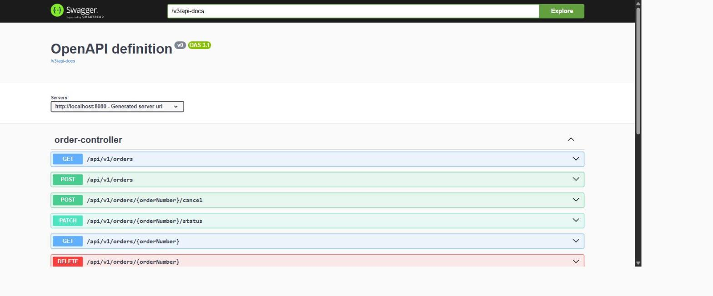
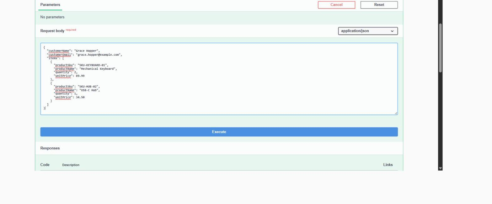
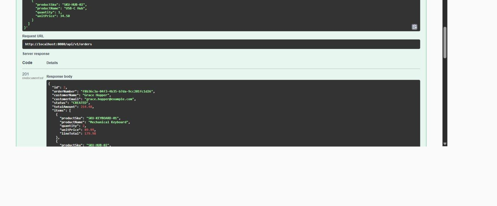
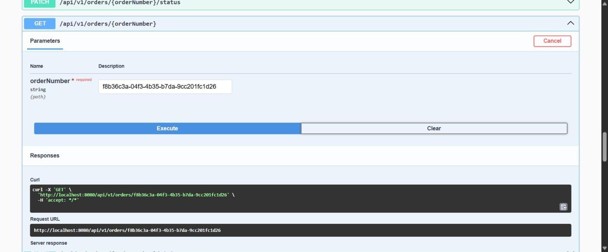

# Order Fulfillment Service

A Spring Boot microservice for managing customer orders: a REST API backed by
PostgreSQL, with order-lifecycle events published to and consumed from Kafka.
It's a self-contained demo of the backend patterns used in an event-driven,
containerized microservices stack (REST + JPA + Kafka + Docker + CI) — not a
copy of any employer's proprietary system.

## API in action

Real requests against a running instance of this service (H2-backed `test`
profile, no Docker required — see "Running locally without Docker" below),
captured via the browsable Swagger UI at `/swagger-ui.html`
([springdoc-openapi](https://springdoc.org/)). Not mockups — every response
body shown here came back from the actual REST + JPA stack.

**All endpoints, browsable and self-documenting:**



**`POST /api/v1/orders` — a real request, filled in and ready to send:**



**...and the real `201 Created` response that came back**, with the
generated `orderNumber`, computed `lineTotal`s, and `totalAmount`:



**`GET /api/v1/orders/{orderNumber}` — fetching that same order back**, shown
with the exact `curl` command Swagger UI generated for the request:



## Problem

An order-processing service needs to: accept orders over HTTP, persist them
reliably, enforce valid state transitions (you can't ship a cancelled order),
and let other parts of the system react to order events without being
tightly coupled to the order service itself. This project implements that:
a REST API for order CRUD plus status transitions, and a Kafka event that
lets a (simulated, colocated) downstream inventory component reserve stock
as soon as an order is created.

## Architecture

```
                 HTTP (JSON)
   Client  ─────────────────────▶  OrderController
                                        │
                                        ▼
                                  OrderService
                              (validation, status
                            transition rules, orchestration)
                                        │
                         ┌──────────────┼──────────────────┐
                         ▼                                 ▼
                  OrderRepository                  OrderEventProducer
                   (Spring Data JPA)                  (Spring Kafka)
                         │                                 │
                         ▼                                 ▼
                    PostgreSQL                     topic: order.created
                 (orders, order_items)              topic: order.status-changed
                                                             │
                                                             ▼
                                              InventoryReservationListener
                                               (@KafkaListener, consumer group
                                                "inventory-reservation-service")
                                                             │
                                                             ▼
                                                InventoryReservationRepository
                                                             │
                                                             ▼
                                                PostgreSQL (inventory_reservations)
```

Flow for the interesting case — creating an order:

1. `POST /api/v1/orders` hits `OrderController`, which delegates to `OrderService`.
2. `OrderService` persists the `Order` + `OrderItem`s via `OrderRepository` (Flyway-managed PostgreSQL schema).
3. In the same request, `OrderEventProducer` publishes an `OrderCreatedEvent` to the `order.created` Kafka topic.
4. `InventoryReservationListener`, a separate `@KafkaListener` consumer group, picks the event off the topic asynchronously and writes an `InventoryReservation` row per line item — simulating a downstream inventory service reacting to the order without being called directly.

Status transitions (`PATCH /api/v1/orders/{orderNumber}/status`, `POST /api/v1/orders/{orderNumber}/cancel`) similarly publish an `OrderStatusChangedEvent` to `order.status-changed`, representing the hook a notifications/shipping service would subscribe to in a fuller system.

### Package layout

```
com.tharunch.orderfulfillment
├── controller   REST endpoints (OrderController)
├── service      Business logic, status-transition rules (OrderService/-Impl)
├── repository   Spring Data JPA repositories
├── model        JPA entities (Order, OrderItem, InventoryReservation, OrderStatus)
├── dto          Request/response records + bean-validation annotations
├── event        Kafka event records, producer, consumer
├── config       Kafka topic provisioning
└── exception    Domain exceptions + @RestControllerAdvice error mapping
```

## Tech stack

| Concern            | Choice                                                            |
|---------------------|--------------------------------------------------------------------|
| Language / runtime  | Java 21 (Temurin), targets Java 17+ baseline                      |
| Framework           | Spring Boot 4.0.7 (Spring Web, Spring Data JPA, Spring Kafka, Bean Validation, Actuator) |
| Build tool          | Gradle 9.5.1 via the committed Gradle Wrapper (no local Gradle install needed) |
| Persistence         | PostgreSQL 16, schema-versioned with Flyway; H2 (Postgres-compat mode) for fast local tests |
| Messaging           | Apache Kafka (KRaft mode, single broker via `apache/kafka:3.8.0`) |
| API docs            | springdoc-openapi (OpenAPI 3.1 + browsable Swagger UI at `/swagger-ui.html`) |
| Tests               | JUnit 5, Mockito, AssertJ, MockMvc, Testcontainers, Awaitility     |
| Containerization    | Multi-stage Dockerfile, Docker Compose (app + Postgres + Kafka)   |
| CI                  | GitHub Actions (`actions/setup-java`, Gradle wrapper, Docker build)|

**Why Spring Boot 4.0 instead of 3.x:** this project was scaffolded against
the live [start.spring.io](https://start.spring.io), which by this point only
generates projects on Spring Boot >= 4.0 (3.x has aged out of the generator's
supported range). Boot 4 keeps the same `jakarta.*` namespace, Spring Data
JPA, and Spring Kafka APIs used throughout this codebase, so the code and
patterns here transfer directly to a Boot 3.x project. One concrete
consequence worth knowing about: Boot 4's auto-configured `ObjectMapper` bean
is now backed by Jackson 3 (`tools.jackson.databind`) rather than the classic
`com.fasterxml.jackson.databind.ObjectMapper` — tests that need to hand-build
JSON request bodies instantiate a plain classic `ObjectMapper` directly
instead of autowiring one (see `OrderControllerTest`).

## Toolchain — how this was actually built (no admin rights, no winget/choco)

This was developed on a Windows machine with only Java 8 preinstalled and no
Maven/Gradle on `PATH`, and no admin rights to install anything system-wide.
Steps taken, in case you're reproducing this setup:

1. **JDK 21**: An Eclipse Temurin JDK 21 (`jdk-21.0.6.7-hotspot`) was already
   present at `%LOCALAPPDATA%\Programs\Eclipse Adoptium\jdk-21.0.6.7-hotspot`
   (installed previously in a user-writable location, no admin needed). If it
   weren't, the same portable-zip approach used for GitHub CLI in this
   environment applies: download a Temurin 21 zip from
   [adoptium.net](https://adoptium.net/temurin/releases/), extract it under
   `%LOCALAPPDATA%`, and point `JAVA_HOME` at it — no installer/admin rights
   required.
2. **Build tool**: rather than installing Gradle system-wide, the project was
   generated through `start.spring.io`'s `starter.zip` endpoint, which ships
   a **Gradle Wrapper** (`gradlew`, `gradlew.bat`, `gradle/wrapper/*`)
   already checked in. Running `./gradlew` the first time downloads Gradle
   9.5.1 itself into `~/.gradle` — no system Gradle install needed, on this
   machine or on a fresh clone.
3. Every `./gradlew` invocation below was run with `JAVA_HOME` pointed at the
   Temurin 21 install (`export JAVA_HOME=".../Eclipse Adoptium/jdk-21.0.6.7-hotspot"`
   on the bash side used during development).

CI does **not** depend on any of this — the GitHub Actions workflow uses
`actions/setup-java@v4` to provision JDK 21 fresh on the runner.

## How to run

### Docker Compose (primary, documented path)

```bash
docker compose up --build
```

This builds the app image from the multi-stage `Dockerfile` and starts three
services: `postgres` (5432), `kafka` (9092 internal / 29092 host-exposed, KRaft
mode, no ZooKeeper), and `app` (8080). Flyway applies the schema
(`src/main/resources/db/migration/V1__init_schema.sql`) against Postgres on
startup.

```bash
curl -X POST http://localhost:8080/api/v1/orders \
  -H "Content-Type: application/json" \
  -d '{
        "customerName": "Ada Lovelace",
        "customerEmail": "ada@example.com",
        "items": [
          {"productSku": "SKU-1", "productName": "Widget", "quantity": 2, "unitPrice": 10.00}
        ]
      }'
```

A moment later, an `InventoryReservation` row will exist for that order,
written by the Kafka consumer that reacted to the `order.created` event.

**Honesty note:** `docker compose up` itself has still not been run in the
sandbox this project was built in — the Docker CLI is installed but no daemon
is running (`com.docker.service` is stopped, and starting it requires admin
rights this environment doesn't have). The Dockerfile and compose file follow
standard, well-tested patterns (multi-stage Temurin build, official
`postgres:16-alpine`, official `apache/kafka:3.8.0` KRaft image), but that
specific command is still unverified locally.

What **has** been verified for real, on GitHub-hosted runners with Docker
preinstalled: the equivalent Testcontainers-based integration test
(`KafkaEventFlowIT`, see below) exercises the same Spring Kafka / Spring Data
JPA wiring against real, ephemeral Postgres and Kafka containers, and it
currently **passes in CI** — it took three real bug fixes to get there
(a missing Flyway autoconfiguration dependency, a missing Jackson JSR-310
module, and replacing `@OrderColumn` with `@OrderBy`), all driven by actual
CI failures, not guesswork.

### Running locally without Docker (app only, against H2)

Not the primary path, but useful for a quick look at the REST layer.

**Honesty note:** `--spring.profiles.active=test` alone does *not* work here,
even though `src/test/resources/application-test.yml` defines a `test`
profile — Gradle's `bootRun` runs off the `main` source set's classpath,
which doesn't include `src/test/resources`, so that profile file is never
picked up and the app falls back to the default Postgres datasource in
`application.yml` (and fails to connect). The working equivalent overrides
the same settings directly on the command line:

```bash
./gradlew bootRun --args='--spring.datasource.url=jdbc:h2:mem:orderdb-test;MODE=PostgreSQL;DB_CLOSE_DELAY=-1 --spring.datasource.driver-class-name=org.h2.Driver --spring.datasource.username=sa --spring.datasource.password= --spring.jpa.hibernate.ddl-auto=create-drop --spring.flyway.enabled=false'
```

This is the H2-backed setup (same idea as `application-test.yml`), so
there's no real broker and no order-created Kafka event actually flowing —
`OrderEventProducer` catches the resulting publish failure and logs it
rather than failing the request (event publishing is a side effect of order
creation, not a dependency of it), so the REST API itself still works end
to end. Browse it at `http://localhost:8080/swagger-ui.html`.

### API endpoints

| Method | Path                                   | Description                              |
|--------|-----------------------------------------|-------------------------------------------|
| POST   | `/api/v1/orders`                        | Create an order                           |
| GET    | `/api/v1/orders/{orderNumber}`          | Fetch an order                            |
| GET    | `/api/v1/orders?status=&page=&size=`    | List orders, optional status filter, paged|
| PATCH  | `/api/v1/orders/{orderNumber}/status`   | Transition order status                   |
| POST   | `/api/v1/orders/{orderNumber}/cancel`   | Cancel an order (business-rule guarded)   |
| DELETE | `/api/v1/orders/{orderNumber}`          | Delete an order                           |

Valid status transitions: `CREATED → PAID → SHIPPED → DELIVERED`, with
`CANCELLED` reachable only from `CREATED` or `PAID`. Anything else returns
`409 Conflict`.

## How to run tests

```bash
./gradlew test
```

This runs the full unit + H2-backed integration suite — **19 tests, all
green, verified in this environment**:

- `OrderServiceImplTest` — Mockito-based unit tests for the service layer: order creation totals, valid/invalid status transitions, not-found handling.
- `OrderControllerTest` — `@WebMvcTest` + MockMvc slice tests for the REST layer: request validation (400s), not-found (404), conflict (409), happy paths.
- `InventoryReservationListenerTest` — Mockito-based unit test for the Kafka consumer's reservation logic.
- `OrderApiIntegrationTest` — full Spring context, MockMvc + real (H2) JPA, exercising the complete create → get → update-status → cancel lifecycle through the actual REST + service + repository stack. The Kafka producer bean is mocked here since no broker is available in this slice.

```bash
./gradlew integrationTest
```

Runs the Testcontainers-tagged suite (`KafkaEventFlowIT`,
`OrderFulfillmentServiceApplicationTests`) against **real** Postgres and
Kafka containers, provisioned via `@ServiceConnection` in
`TestcontainersConfiguration`. Requires a running Docker daemon, so it's
**not run locally in this environment** (see above) — but it does run for
real in the `integration-test` CI job on every push, and currently passes.
It is intentionally excluded from the default `test` task and from
`build`/`check` (see the JUnit tag wiring in `build.gradle`) precisely so
that `./gradlew build` works on a machine without Docker.

## Persistence notes

Two schema-management strategies are used, deliberately, for different
purposes:

- **Production / real Postgres path**: Flyway migrations
  (`src/main/resources/db/migration/V1__init_schema.sql`) are the source of
  truth; `spring.jpa.hibernate.ddl-auto=validate` ensures the entity mappings
  never silently drift from the migration. This is what runs in Docker
  Compose and in the Testcontainers-backed integration test.
- **Fast local/CI test path**: the `test` Spring profile disables Flyway and
  lets Hibernate generate the schema from the entity model
  (`ddl-auto=create-drop`) against in-memory H2. This keeps `OrderControllerTest`
  and `OrderApiIntegrationTest` fast and Docker-free, at the cost of not
  exercising the literal migration SQL — that trade-off is covered by the
  Testcontainers suite, which does run the real migration against real
  Postgres.

## What was verified where

| Claim                                              | Verified how                                             |
|------------------------------------------------------|------------------------------------------------------------|
| Compiles (`main` + `test` source sets)                | `./gradlew compileJava compileTestJava` — ran locally, succeeded |
| Unit tests (service layer, Kafka consumer)            | `./gradlew test` — ran locally, all passing               |
| REST layer (validation, status codes, error mapping)  | `./gradlew test` (`OrderControllerTest`) — ran locally, all passing |
| Full REST → service → JPA lifecycle                   | `./gradlew test` (`OrderApiIntegrationTest`, H2) — ran locally, all passing |
| `./gradlew build` (assemble + test + bootJar)          | ran locally, succeeded                                     |
| Kafka producer → real broker → consumer → Postgres     | not executed locally (no Docker daemon); **verified in CI's `integration-test` job — currently passing** |
| `docker compose up` end-to-end                        | still not executed anywhere (local or CI); Dockerfile build itself is checked in CI's `docker-build` job |
| GitHub Actions CI itself                               | not run locally (no `act`/local runner used) — runs for real on every push; latest run is green |

## Requirements

- Java 17+ to build/run directly (developed and tested against JDK 21).
- Docker + Docker Compose for the full stack (Postgres + Kafka + app).
- No local Gradle install needed — use the committed wrapper (`./gradlew` / `gradlew.bat`).
